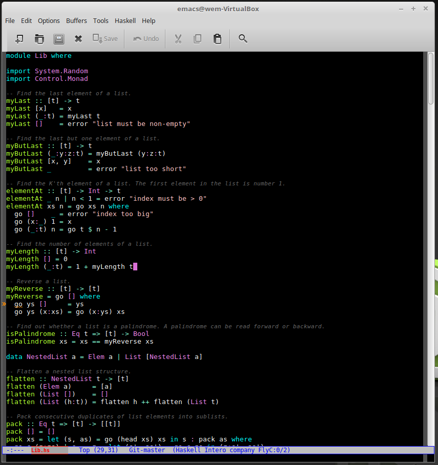

# My emacs `init.el` file for Haskell development using intero
This init file configures emacs to:

* use `intero` for **both** stack and non-stack haskell files
* use flycheck to show `hlint` warnings as-you-type (must install `hlint` separately - see below)
* use `hasky-stack` for invoking stack from emacs
* use Shift+arrow keys to do window navigation 
* sets some other look-and-feel related settings

## Installation
1. install [stack](https://docs.haskellstack.org/en/stable/install_and_upgrade/)
1. install `hlint` globally using `stack install hlint` (run from outside a stack project)
1. install [emacs](https://www.gnu.org/software/emacs/)
1. copy `init.el` file (from this repo) to `~/.emacs.d` directory on your machine (create the directory if necessary)

The first time a haskell file is opened in emacs it will take some time to install everything.

## keyboard shortcuts

| Key binding            | Description                                      |
| --------               | --------                                         |
| `Alt-.`	             | Jump to definition                               |
| `Ctl-c` `Ctl-i`        | Show information of identifier at point          |
| `Ctl-c` `Ctl-t`        | Show the type of thing at point, or the selection|
| `Ctl-u` `Ctl-c` `Ctl-t`| Insert a type signature for the thing at point   |
| `Ctl-c` `Ctl-l`        | Load this module in the REPL                     |
| `Ctl-c` `Ctl-c`        | Evaluate the selected region in the REPL         |
| `Ctl-c` `Ctl-r`        | Apply suggestions from GHC                       |
| `Ctl-c` `Ctl-k`	     | Clear REPL                                       |
| `Ctl-c` `Ctl-z`        | Switch to and from the REPL                      |
| `Shift-arrow`          | move to window in arrow direction                |
| `Alt-s` `Alt-s`        | stack command menu                               |
| `Alt-s` `Alt-t`        | stack targets menu                               |

The 2 stack commands only work when editing files within a stack project.

Reminder: select region: `Ctl+space`, cut: `Ctl-w`, copy: `Alt-w`, paste: `Ctl-y`.

(Don't be tempted to enable `cua` mode because you won't be able to show type of selections using `Ctl-c` `Ctl-t`.)

Screenshot:

